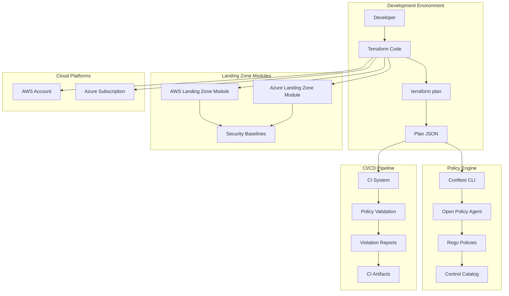

# Design Document: Multi-Cloud Security Policy System

## Overview

The Multi-Cloud Security Policy system implements a policy-as-code approach for securing Terraform-based infrastructure across AWS and Azure. The system consists of two primary layers: secure-by-default Terraform landing zone modules and a policy guardrail layer that validates Terraform plans before deployment using Open Policy Agent (OPA) and Conftest.

The architecture emphasizes prevention over detection, catching security misconfigurations at plan-time rather than after deployment. This approach reduces security risks, compliance violations, and the cost of remediation by blocking unsafe changes before they reach production environments.

## Architecture

### High-Level Architecture



### Component Architecture

The system follows a modular architecture with clear separation of concerns:

1. **Landing Zone Layer**: Terraform modules providing secure infrastructure baselines
2. **Policy Engine Layer**: OPA-based policy evaluation and enforcement
3. **Control Management Layer**: Framework-mapped security controls with toggle capabilities
4. **Reporting Layer**: Violation reporting and compliance evidence generation
5. **Integration Layer**: CI/CD pipeline integration and local development tools

## Components and Interfaces

### Landing Zone Modules

**AWS Landing Zone Module**
- Provides secure-by-default configurations for AWS Organizations, IAM, CloudTrail, Config, GuardDuty, and VPC
- Implements CIS AWS Foundations Benchmark controls
- Supports environment-specific configurations (dev/test/prod)
- Includes comprehensive documentation and examples

**Azure Landing Zone Module**
- Provides secure-by-default configurations for Management Groups, RBAC, Azure Policy, Defender for Cloud, and VNets
- Implements CIS Azure Foundations Benchmark controls
- Supports subscription-level and management group-level deployments
- Includes ARM template integration for hybrid scenarios

**Interface Specification:**
```hcl
module "aws_landing_zone" {
  source = "./modules/aws-landing-zone"
  
  # Environment configuration
  environment = var.environment
  organization_name = var.organization_name
  
  # Security baseline toggles
  enable_guardduty = var.enable_guardduty
  enable_config = var.enable_config
  enable_cloudtrail = var.enable_cloudtrail
  
  # Networking configuration
  vpc_cidr = var.vpc_cidr
  enable_flow_logs = var.enable_flow_logs
  
  # Compliance framework
  compliance_framework = var.compliance_framework
}
```

### Policy Engine

**OPA Integration**
- Uses Open Policy Agent as the core policy evaluation engine
- Evaluates Rego policies against Terraform plan JSON
- Provides deterministic policy evaluation results
- Supports policy composition and modular rule organization

**Conftest Integration**
- Serves as the command-line interface for policy testing
- Integrates seamlessly with CI/CD pipelines
- Provides structured output in JSON and human-readable formats
- Supports policy directory organization and discovery

**Policy Structure:**
```rego
package terraform.security.aws.s3

import rego.v1

# Control: S3-001 - S3 buckets must have encryption enabled
deny contains msg if {
    resource := input.planned_values.root_module.resources[_]
    resource.type == "aws_s3_bucket"
    not resource.values.server_side_encryption_configuration
    
    msg := {
        "control_id": "S3-001",
        "severity": "HIGH",
        "resource": resource.address,
        "message": "S3 bucket must have server-side encryption enabled",
        "remediation": "Add server_side_encryption_configuration block to aws_s3_bucket resource"
    }
}
```

### Control Management System

**Control Catalog**
- Maintains a comprehensive catalog of security controls
- Maps controls to compliance frameworks (NIST 800-53, ISO 27001, CIS)
- Provides control metadata including severity, description, and remediation guidance
- Supports control versioning and lifecycle management

**Control Toggle Mechanism**
- Implements comment/uncomment-based control enabling/disabling
- Maintains control state through version control history
- Provides clear control block structure with metadata
- Supports bulk control operations through scripting

**Control Structure:**
```rego
# CONTROL: NET-001
# TITLE: No public SSH access from 0.0.0.0/0
# SEVERITY: CRITICAL
# FRAMEWORKS: NIST-800-53:AC-4, CIS-AWS:4.1, ISO-27001:A.13.1.1
# STATUS: ENABLED (uncomment to disable)

package terraform.security.aws.networking

deny contains msg if {
    resource := input.planned_values.root_module.resources[_]
    resource.type == "aws_security_group_rule"
    resource.values.type == "ingress"
    resource.values.from_port == 22
    resource.values.cidr_blocks[_] == "0.0.0.0/0"
    
    msg := {
        "control_id": "NET-001",
        "severity": "CRITICAL",
        "resource": resource.address,
        "message": "Security group allows SSH access from 0.0.0.0/0",
        "remediation": "Restrict SSH access to specific IP ranges or use bastion hosts"
    }
}
```

### Validation Framework

**Test Environment**
- Provides isolated environment for policy testing
- Supports mock resource generation for comprehensive testing
- Enables positive and negative test case execution
- Integrates with existing testing frameworks

**Syntax Validation**
- Validates Rego policy syntax before deployment
- Provides detailed error reporting with line numbers
- Supports policy linting and best practice enforcement
- Integrates with code editors through language servers

### Reporting System

**Violation Reports**
- Generates structured JSON reports with violation details
- Creates human-readable markdown summaries
- Includes remediation guidance and framework mappings
- Supports severity-based filtering and prioritization

**Compliance Evidence**
- Generates compliance matrices mapping controls to frameworks
- Provides audit trails for control toggle history
- Exports evidence in multiple formats (CSV, JSON, PDF)
- Maintains historical compliance data for trend analysis

## Data Models

### Policy Definition Model

```json
{
  "control_id": "string",
  "title": "string",
  "description": "string",
  "severity": "LOW|MEDIUM|HIGH|CRITICAL",
  "frameworks": {
    "nist_800_53": ["string"],
    "iso_27001": ["string"],
    "cis": ["string"]
  },
  "cloud_provider": "aws|azure|multi",
  "domain": "identity|network|logging|data|governance",
  "status": "enabled|disabled",
  "policy_code": "string",
  "test_cases": [
    {
      "name": "string",
      "type": "positive|negative",
      "input": "object",
      "expected_result": "pass|fail"
    }
  ],
  "remediation": {
    "description": "string",
    "terraform_example": "string",
    "documentation_links": ["string"]
  }
}
```

### Violation Report Model

```json
{
  "scan_metadata": {
    "timestamp": "ISO8601",
    "environment": "string",
    "commit_hash": "string",
    "scan_mode": "local|ci",
    "terraform_version": "string",
    "conftest_version": "string"
  },
  "summary": {
    "total_resources": "number",
    "total_violations": "number",
    "violations_by_severity": {
      "critical": "number",
      "high": "number",
      "medium": "number",
      "low": "number"
    }
  },
  "violations": [
    {
      "control_id": "string",
      "severity": "string",
      "resource_address": "string",
      "resource_type": "string",
      "message": "string",
      "remediation": "string",
      "frameworks": ["string"],
      "file_location": {
        "filename": "string",
        "line_number": "number"
      }
    }
  ]
}
```

### Landing Zone Configuration Model

```json
{
  "environment": "dev|test|prod",
  "organization": {
    "name": "string",
    "domain": "string",
    "compliance_frameworks": ["string"]
  },
  "aws": {
    "organization_id": "string",
    "master_account_id": "string",
    "regions": ["string"],
    "services": {
      "guardduty": "boolean",
      "config": "boolean",
      "cloudtrail": "boolean",
      "security_hub": "boolean"
    }
  },
  "azure": {
    "tenant_id": "string",
    "management_group_id": "string",
    "subscriptions": ["string"],
    "services": {
      "defender_for_cloud": "boolean",
      "azure_policy": "boolean",
      "log_analytics": "boolean"
    }
  },
  "networking": {
    "aws_vpc_cidr": "string",
    "azure_vnet_cidr": "string",
    "enable_flow_logs": "boolean",
    "hub_spoke_topology": "boolean"
  }
}
```

## Correctness Properties

*A property is a characteristic or behavior that should hold true across all valid executions of a system—essentially, a formal statement about what the system should do. Properties serve as the bridge between human-readable specifications and machine-verifiable correctness guarantees.*

Based on the requirements analysis, the following correctness properties ensure the system behaves correctly across all valid inputs and scenarios:

### Property 1: Policy Evaluation Consistency
*For any* Terraform plan JSON and set of enabled policies, evaluating the same plan with the same policies in different environments (local, CI, different machines) should produce identical violation results.
**Validates: Requirements 3.2, 9.5, 10.3**

### Property 2: Control Toggle Behavior
*For any* control in the policy codebase, when the control is uncommented it should be evaluated against plans, and when commented it should be ignored during evaluation.
**Validates: Requirements 4.2, 4.3**

### Property 3: Violation Report Completeness
*For any* policy violation detected during evaluation, the generated report should contain all required fields: control ID, severity, resource address, violation message, and remediation guidance.
**Validates: Requirements 3.4, 6.1, 6.3**

### Property 4: Output Format Generation
*For any* completed scan, the system should generate both machine-readable JSON reports and human-readable markdown summaries with consistent violation information.
**Validates: Requirements 3.3, 6.1, 6.2**

### Property 5: Error Handling Continuity
*For any* set of policies with multiple potential violations, the system should evaluate all policies and report all violations rather than stopping at the first error.
**Validates: Requirements 3.5, 9.4**

### Property 6: Control Metadata Completeness
*For any* control in the system, it should have a unique ID, valid severity level, and at least one framework mapping (NIST, ISO, or CIS).
**Validates: Requirements 5.1, 5.2**

### Property 7: Secure Configuration Application
*For any* landing zone module deployment with valid environment inputs, the resulting infrastructure should have secure-by-default configurations applied automatically.
**Validates: Requirements 1.3**

### Property 8: Environment Input Flexibility
*For any* landing zone module and valid environment input (dev/test/prod), the module should deploy successfully without requiring source code changes.
**Validates: Requirements 1.4**

### Property 9: Policy Evaluation Against Plan JSON
*For any* valid Terraform plan JSON and enabled policy set, the OPA engine should evaluate all enabled policies and return structured results.
**Validates: Requirements 3.1, 9.3**

### Property 10: Severity-Based Filtering
*For any* violation report and severity filter (low/medium/high/critical), the filtered report should contain only violations matching the specified severity level.
**Validates: Requirements 6.4**

### Property 11: Control Structure Consistency
*For any* control added to the system, it should follow the established structure pattern with required metadata fields and proper Rego syntax.
**Validates: Requirements 8.1, 8.5**

### Property 12: Control Organization
*For any* control in the system, it should be properly grouped by cloud provider (AWS/Azure) and domain (identity/network/logging/data/governance).
**Validates: Requirements 8.2**

### Property 13: Test Case Coverage
*For any* control in the system, it should have both positive test cases (that should pass) and negative test cases (that should fail).
**Validates: Requirements 8.4**

### Property 14: Credential Independence
*For any* basic policy validation operation, the system should execute successfully without requiring cloud provider credentials.
**Validates: Requirements 10.2, 11.3**

### Property 15: Syntax Error Reporting
*For any* policy file with syntax errors, the system should provide clear error messages indicating the specific location and nature of the syntax issue.
**Validates: Requirements 4.6, 10.4**

### Property 16: Secret Absence
*For any* file in the repository, it should not contain hardcoded secrets, credentials, or sensitive information.
**Validates: Requirements 11.1**

### Property 17: Standard Credential Provider Support
*For any* operation requiring cloud credentials, the system should successfully authenticate using standard credential providers (environment variables, IAM roles, managed identities).
**Validates: Requirements 11.4**

### Property 18: Secure Logging
*For any* security-relevant event logged by the system, the log entry should contain necessary information for security monitoring without exposing sensitive data.
**Validates: Requirements 11.5**

### Property 19: Good Example Validation
*For any* "good" example in the repository, running all enabled controls against it should result in zero violations.
**Validates: Requirements 7.4**

### Property 20: Bad Example Violation
*For any* "bad" example in the repository, running controls against it should produce the expected violations that the example was designed to trigger.
**Validates: Requirements 7.5**

## Error Handling

The system implements comprehensive error handling across all components:

### Policy Evaluation Errors
- **Syntax Errors**: Invalid Rego syntax is detected during policy loading with specific line number and error description
- **Evaluation Errors**: Runtime errors during policy evaluation are caught and reported with context
- **Plan JSON Errors**: Invalid or malformed Terraform plan JSON is validated before processing

### Infrastructure Deployment Errors
- **Module Errors**: Terraform module errors are captured and reported with specific resource and configuration details
- **Provider Errors**: Cloud provider API errors are handled with appropriate retry logic and user-friendly messages
- **Validation Errors**: Pre-deployment validation errors prevent invalid configurations from being applied

### Integration Errors
- **CI/CD Errors**: Pipeline integration errors are reported with actionable remediation steps
- **Tool Errors**: External tool failures (OPA, Conftest, Terraform) are handled gracefully with fallback options
- **Network Errors**: Network connectivity issues are handled with retry mechanisms and offline capabilities

### Error Recovery Strategies
- **Graceful Degradation**: System continues operation with reduced functionality when non-critical components fail
- **Retry Logic**: Transient errors are handled with exponential backoff and configurable retry limits
- **Rollback Capabilities**: Failed deployments can be rolled back to previous known-good states

## Testing Strategy

The system employs a dual testing approach combining unit tests for specific scenarios and property-based tests for comprehensive validation:

### Unit Testing Approach
Unit tests focus on specific examples, edge cases, and integration points:
- **Module Testing**: Terraform modules are tested with known-good and known-bad configurations
- **Policy Testing**: Individual Rego policies are tested with crafted input scenarios
- **Integration Testing**: End-to-end workflows are tested with realistic data
- **Error Condition Testing**: Specific error scenarios are tested to ensure proper handling

### Property-Based Testing Approach
Property-based tests validate universal properties across randomized inputs:
- **Policy Evaluation Properties**: Test policy evaluation consistency across different inputs
- **Control Toggle Properties**: Test control enabling/disabling behavior with various control sets
- **Report Generation Properties**: Test report completeness and format consistency
- **Security Properties**: Test that security invariants hold across all configurations

### Testing Configuration
- **Minimum Test Iterations**: Each property-based test runs a minimum of 100 iterations
- **Test Data Generation**: Realistic Terraform plan JSON and policy configurations are generated
- **Framework Integration**: Tests integrate with existing Terraform testing frameworks (Terratest, Kitchen-Terraform)
- **CI/CD Integration**: All tests run automatically in CI/CD pipelines with clear pass/fail reporting

### Test Organization
Tests are organized by component and property:
```
tests/
├── unit/
│   ├── modules/
│   ├── policies/
│   └── integration/
├── property/
│   ├── policy_evaluation/
│   ├── control_management/
│   └── security/
└── fixtures/
    ├── terraform_plans/
    ├── good_examples/
    └── bad_examples/
```

Each property-based test includes a comment tag referencing its design document property:
```go
// Feature: multi-cloud-security-policy, Property 1: Policy Evaluation Consistency
func TestPolicyEvaluationConsistency(t *testing.T) {
    // Property-based test implementation
}
```

The testing strategy ensures comprehensive coverage while maintaining fast feedback cycles for developers and reliable validation for production deployments.