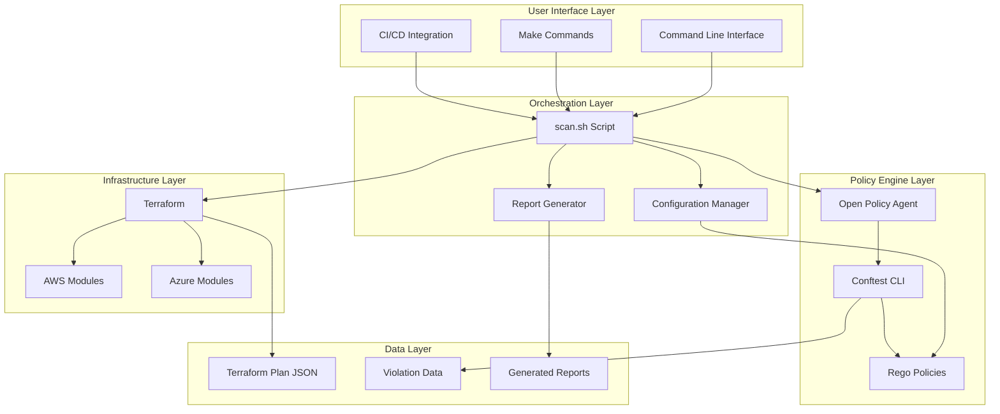
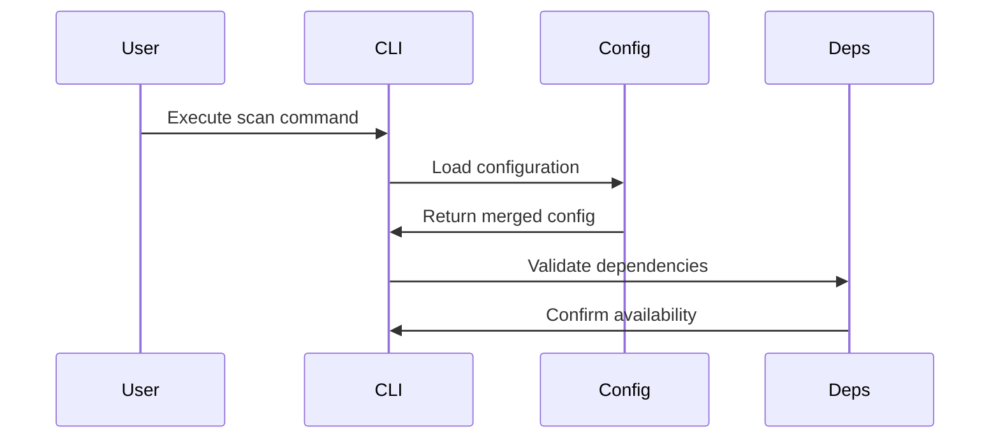
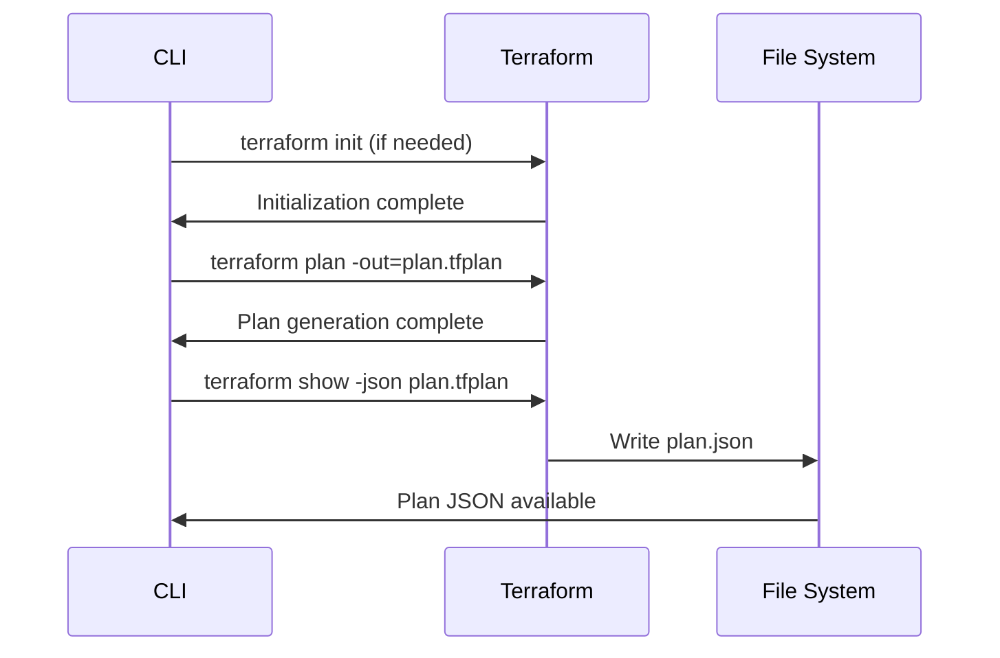
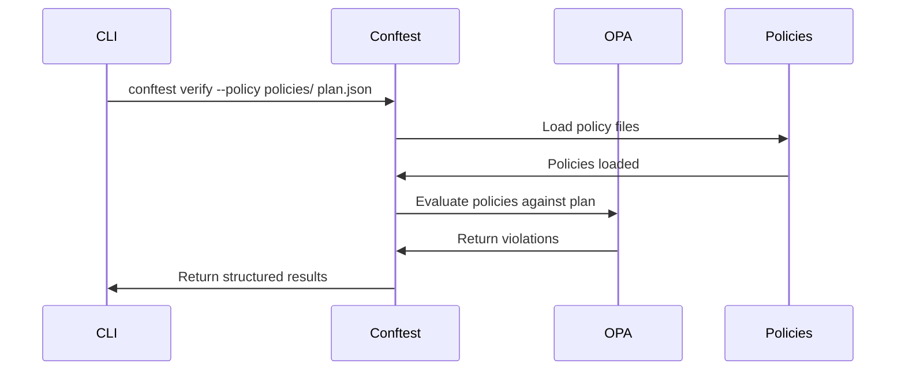
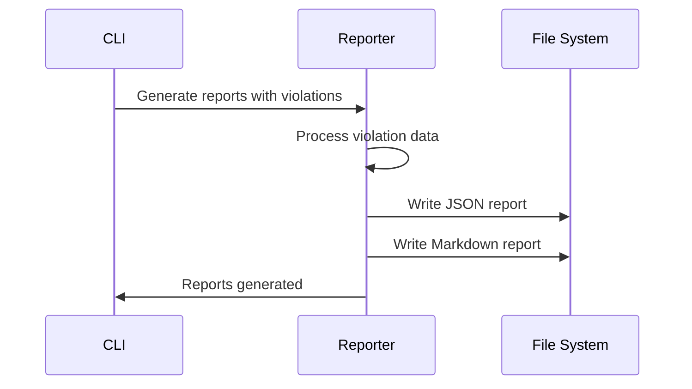

# Architecture Overview

## System Architecture

The Multi-Cloud Security Policy System follows a modular architecture designed for scalability, maintainability, and security. This document provides a comprehensive overview of the system's components and their interactions.

## High-Level Architecture



## System Design Principles

### Design Philosophy

The Multi-Cloud Security Policy System is built on several core design principles:

#### 1. Prevention Over Detection
- **Shift-left security**: Catch issues during development, not in production
- **Plan-time validation**: Analyze infrastructure before deployment
- **Fail-fast approach**: Stop unsafe changes before they reach cloud environments
- **Cost reduction**: Prevent expensive remediation by blocking issues early

#### 2. Developer Experience First
- **Simple interfaces**: Single command execution for complex workflows
- **Clear feedback**: Human-readable error messages and remediation guidance
- **Minimal friction**: Integrate seamlessly with existing development workflows
- **Self-service**: Enable developers to understand and fix issues independently

#### 3. Multi-Cloud Consistency
- **Unified policy language**: Same Rego syntax for all cloud providers
- **Consistent patterns**: Similar control structures across AWS and Azure
- **Framework alignment**: Common compliance mappings regardless of cloud
- **Portable skills**: Knowledge transfers between cloud platforms

#### 4. Modularity and Extensibility
- **Composable components**: Each component can be used independently
- **Plugin architecture**: Easy addition of new cloud providers or frameworks
- **Clear interfaces**: Well-defined APIs between components
- **Backward compatibility**: Changes don't break existing integrations

#### 5. Security by Design
- **Least privilege**: Minimal permissions required for operation
- **No credential storage**: Credentials never persisted or logged
- **Audit trails**: Complete logging of security-relevant events
- **Secure defaults**: Safe configurations out of the box

### Architectural Patterns

#### 1. Pipeline Architecture
The system follows a pipeline pattern where data flows through distinct stages:

```
Input → Validation → Processing → Evaluation → Reporting → Output
```

Each stage has clear responsibilities and can be tested independently.

#### 2. Plugin Architecture
Components are designed as plugins that can be added or removed:

```
Core Engine
├── Cloud Provider Plugins (AWS, Azure, GCP)
├── Policy Engine Plugins (OPA, Custom)
├── Report Generator Plugins (JSON, Markdown, CSV)
└── Integration Plugins (GitHub, GitLab, Jenkins)
```

#### 3. Configuration-Driven Behavior
System behavior is controlled through configuration rather than code changes:

```yaml
# Environment-specific behavior
scan:
  severity_filter: "high"
  continue_on_error: false
  
policies:
  enabled_frameworks: ["nist-800-53", "cis"]
  custom_controls: ["ORG-001", "ORG-002"]
  
output:
  formats: ["json", "markdown"]
  include_remediation: true
```

#### 4. Event-Driven Processing
Components communicate through events rather than direct coupling:

```
Terraform Plan Generated → Policy Evaluation Triggered → Violations Detected → Report Generated
```

This allows for easy extension and modification of the processing pipeline.

## Integration Patterns

### Local Development Integration

#### IDE Integration
```bash
# VS Code tasks.json example
{
  "version": "2.0.0",
  "tasks": [
    {
      "label": "Security Scan",
      "type": "shell",
      "command": "./scripts/scan.sh",
      "args": ["-d", "${workspaceFolder}", "-o", "both"],
      "group": "test",
      "presentation": {
        "echo": true,
        "reveal": "always",
        "focus": false,
        "panel": "shared"
      }
    }
  ]
}
```

#### Pre-commit Hooks
```bash
# .pre-commit-config.yaml
repos:
  - repo: local
    hooks:
      - id: security-scan
        name: Security Policy Scan
        entry: ./scripts/scan.sh
        language: system
        files: '\.tf$'
        pass_filenames: false
```

### CI/CD Integration Patterns

#### GitHub Actions Integration
```yaml
name: Security Policy Validation
on:
  pull_request:
    paths: ['**.tf', '**.tfvars']
  
jobs:
  security-scan:
    runs-on: ubuntu-latest
    steps:
      - uses: actions/checkout@v3
      - name: Setup Tools
        run: make install
      - name: Security Scan
        run: make scan
        env:
          SEVERITY_FILTER: high
      - name: Comment PR
        uses: actions/github-script@v6
        if: failure()
        with:
          script: |
            const fs = require('fs');
            const report = fs.readFileSync('reports/scan-report.md', 'utf8');
            github.rest.issues.createComment({
              issue_number: context.issue.number,
              owner: context.repo.owner,
              repo: context.repo.repo,
              body: `## Security Policy Violations\n\n${report}`
            });
```

#### GitLab CI Integration
```yaml
security-scan:
  stage: validate
  image: alpine:latest
  before_script:
    - apk add --no-cache make bash curl
    - make install
  script:
    - make scan
  artifacts:
    reports:
      junit: reports/scan-report.xml
    paths:
      - reports/
    expire_in: 1 week
  rules:
    - changes:
        - "**/*.tf"
        - "**/*.tfvars"
```

#### Jenkins Pipeline Integration
```groovy
pipeline {
    agent any
    
    stages {
        stage('Security Scan') {
            when {
                anyOf {
                    changeset "**/*.tf"
                    changeset "**/*.tfvars"
                }
            }
            steps {
                sh 'make install'
                sh 'make scan'
                publishHTML([
                    allowMissing: false,
                    alwaysLinkToLastBuild: true,
                    keepAll: true,
                    reportDir: 'reports',
                    reportFiles: 'scan-report.html',
                    reportName: 'Security Scan Report'
                ])
            }
            post {
                always {
                    archiveArtifacts artifacts: 'reports/*', fingerprint: true
                }
                failure {
                    emailext (
                        subject: "Security Policy Violations in ${env.JOB_NAME} - ${env.BUILD_NUMBER}",
                        body: "Security policy violations detected. Check the build report for details.",
                        to: "${env.CHANGE_AUTHOR_EMAIL}"
                    )
                }
            }
        }
    }
}
```

### Enterprise Integration

#### SIEM Integration
```bash
# Example: Splunk integration
./scripts/scan.sh -o json | \
  jq '.violations[] | select(.severity == "CRITICAL")' | \
  curl -X POST "https://splunk.company.com:8088/services/collector" \
    -H "Authorization: Splunk ${SPLUNK_TOKEN}" \
    -d @-
```

#### Ticketing System Integration
```bash
# Example: Jira integration for critical violations
CRITICAL_VIOLATIONS=$(./scripts/scan.sh -o json | jq '.violations[] | select(.severity == "CRITICAL")')

if [ -n "$CRITICAL_VIOLATIONS" ]; then
  curl -X POST "https://company.atlassian.net/rest/api/2/issue" \
    -H "Content-Type: application/json" \
    -H "Authorization: Basic ${JIRA_TOKEN}" \
    -d '{
      "fields": {
        "project": {"key": "SEC"},
        "summary": "Critical Security Policy Violations Detected",
        "description": "'"${CRITICAL_VIOLATIONS}"'",
        "issuetype": {"name": "Bug"}
      }
    }'
fi
```

#### Dashboard Integration
```bash
# Example: Grafana metrics integration
VIOLATION_COUNT=$(./scripts/scan.sh -o json | jq '.summary.total_violations')
CRITICAL_COUNT=$(./scripts/scan.sh -o json | jq '.summary.violations_by_severity.critical')

curl -X POST "https://grafana.company.com/api/annotations" \
  -H "Authorization: Bearer ${GRAFANA_TOKEN}" \
  -H "Content-Type: application/json" \
  -d '{
    "text": "Security scan completed: '"${VIOLATION_COUNT}"' violations ('"${CRITICAL_COUNT}"' critical)",
    "tags": ["security", "policy", "terraform"]
  }'
```

### 1. User Interface Layer

#### Command Line Interface (CLI)
- **Primary Interface**: `scripts/scan.sh`
- **Purpose**: Main entry point for policy validation
- **Features**:
  - Flexible command-line options
  - Environment-specific configurations
  - Multiple output formats
  - Severity filtering

#### Make Commands
- **Purpose**: Simplified command execution
- **Features**:
  - Common development tasks
  - Environment-specific targets
  - Testing and validation workflows
  - CI/CD integration helpers

#### CI/CD Integration
- **Supported Platforms**: GitHub Actions, GitLab CI, Jenkins, Azure DevOps
- **Features**:
  - Automated policy validation
  - Report generation and storage
  - Build failure on violations
  - Artifact management

### 2. Orchestration Layer

#### Main Orchestration Script (`scan.sh`)
- **Purpose**: Coordinates all system components
- **Responsibilities**:
  - Dependency validation
  - Terraform plan generation
  - Policy evaluation orchestration
  - Report generation coordination
  - Error handling and cleanup

#### Configuration Manager
- **Purpose**: Manages environment-specific settings
- **Features**:
  - YAML-based configuration
  - Environment inheritance
  - Runtime configuration merging
  - Validation and defaults

#### Report Generator
- **Purpose**: Creates formatted output reports
- **Supported Formats**:
  - JSON (machine-readable)
  - Markdown (human-readable)
  - CSV (compliance matrices)

### 3. Policy Engine Layer

#### Open Policy Agent (OPA)
- **Purpose**: Core policy evaluation engine
- **Features**:
  - Rego policy language support
  - JSON input processing
  - Deterministic evaluation
  - Performance optimization

#### Conftest
- **Purpose**: CLI interface for OPA
- **Features**:
  - Policy directory management
  - Structured output formats
  - CI/CD integration
  - Batch processing

#### Rego Policies
- **Organization**: By cloud provider and domain
- **Structure**:
  ```
  policies/
  ├── aws/
  │   ├── identity/
  │   ├── networking/
  │   ├── logging/
  │   └── data/
  ├── azure/
  │   ├── identity/
  │   ├── networking/
  │   ├── logging/
  │   └── data/
  └── common/
      └── shared/
  ```

### 4. Infrastructure Layer

#### Terraform
- **Purpose**: Infrastructure as Code engine
- **Integration Points**:
  - Plan generation (`terraform plan`)
  - JSON export (`terraform show -json`)
  - Workspace management
  - State management

#### Landing Zone Modules
- **AWS Modules**:
  - Organization setup
  - IAM baselines
  - Network foundations
  - Security services
  
- **Azure Modules**:
  - Management groups
  - RBAC configurations
  - Network foundations
  - Security services

### 5. Data Layer

#### Terraform Plan JSON
- **Purpose**: Structured representation of infrastructure changes
- **Content**:
  - Resource configurations
  - Planned changes
  - Variable values
  - Provider configurations

#### Violation Data
- **Purpose**: Structured policy violation information
- **Schema**:
  ```json
  {
    "control_id": "string",
    "severity": "string",
    "resource_address": "string",
    "message": "string",
    "remediation": "string",
    "frameworks": ["string"]
  }
  ```

#### Generated Reports
- **Purpose**: Formatted output for consumption
- **Types**:
  - Scan reports (JSON/Markdown)
  - Compliance matrices (CSV)
  - Audit logs (JSON)

## Data Flow

### 1. Initialization Phase


### 2. Plan Generation Phase


### 3. Policy Evaluation Phase


### 4. Report Generation Phase


## Security Architecture

### Security Boundaries
1. **Input Validation**: All inputs validated at entry points
2. **Credential Isolation**: Credentials never logged or exposed
3. **Process Isolation**: Each component runs with minimal privileges
4. **Output Sanitization**: Reports sanitized before generation

### Trust Model
- **Terraform Plans**: Trusted input from validated Terraform
- **Policy Files**: Trusted code reviewed and version controlled
- **Configuration**: Validated against schema before use
- **External Tools**: Dependency validation before execution

### Threat Mitigation
- **Code Injection**: Input validation and sanitization
- **Credential Exposure**: Secure credential handling patterns
- **Data Exfiltration**: Minimal data retention and secure logging
- **Denial of Service**: Resource limits and timeout controls

## Performance Considerations

### Optimization Strategies
1. **Policy Caching**: Cache compiled policies for reuse
2. **Parallel Evaluation**: Evaluate independent policies concurrently
3. **Incremental Processing**: Process only changed resources when possible
4. **Resource Limits**: Implement timeouts and memory limits

### Scalability Factors
- **Plan Size**: Large Terraform plans may require streaming processing
- **Policy Count**: Many policies may benefit from parallel evaluation
- **Report Generation**: Large reports may need pagination or streaming
- **Concurrent Scans**: Multiple simultaneous scans may need resource management

## Extension Points

### Adding New Cloud Providers
1. Create provider-specific policy directory
2. Implement provider resource mappings
3. Add provider-specific landing zone modules
4. Update configuration schemas

### Adding New Policy Types
1. Define policy structure and metadata
2. Implement Rego policy logic
3. Add test cases and examples
4. Update documentation and catalogs

### Adding New Output Formats
1. Implement format-specific generator
2. Add configuration options
3. Update CLI and Make targets
4. Add format validation

### Adding New Integrations
1. Implement integration-specific adapters
2. Add configuration and authentication
3. Update orchestration scripts
4. Add integration tests

## Deployment Patterns

### Local Development
- Single-user environment
- File-based configuration
- Local credential management
- Interactive debugging

### CI/CD Pipeline
- Automated execution
- Environment-based configuration
- Secure credential injection
- Artifact storage and retrieval

### Enterprise Deployment
- Multi-tenant support
- Centralized policy management
- Audit logging and compliance
- Integration with security tools

---

This architecture provides a solid foundation for secure, scalable, and maintainable multi-cloud security policy validation.